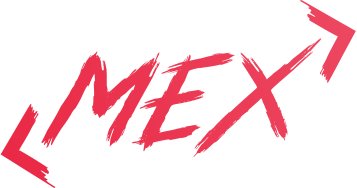

<div align="center">
    
    <h1>Tresdoce Toolkit</h1>
</div>

<div align="center">
    
    
    
    <a href="./license.md">
        
    </a>
    <br/>
    <a href="https://github.com/tresdoce/tresdoce-toolkit/actions/workflows/master.yml" target="_blank">
        
    </a>
    <a href="https://app.codecov.io/gh/tresdoce/tresdoce-toolkit/" target="_blank">
        
    </a>
    <a href="https://sonarcloud.io/summary/new_code?id=tresdoce_tresdoce-toolkit" target="_blank">  
        
    </a>
    <a href="https://snyk.io/test/github/tresdoce/tresdoce-toolkit" target="_blank">
        
    </a>
    <br/> 
</div>
<br>

## Glosario

- [📝 Requerimientos básicos](#basic-requirements)
- [💻 Scripts](#scripts)
- [🧰 Toolkit](#toolkit)
- [📤 Commits](#commits)
- [📜 License MIT](license.md)

---

<a name="basic-requirements"></a>

## 📝 Requerimientos básicos

- Node.js v14.17.0 or higher ([Download](https://nodejs.org/es/download/))
- YARN v1.22.17 or higher
- NPM v6.14.13 or higher
- Lerna

<a name="scripts"></a>

## 💻 Scripts

Instalar Lerna

```
npm i -g lerna
```

Instalar dependencias del monorepo

```
yarn install
```

Crear paquetes

```
yarn plop
```

Transpilar paquetes

```
yarn build
```

Test paquetes

```
yarn test
```

<a name="toolkit"></a>

## 🧰 Toolkit

| Package                                                 | Descripción                             | Versión                                                                                                                                 | Changelog                                       |
|---------------------------------------------------------|-----------------------------------------|-----------------------------------------------------------------------------------------------------------------------------------------|-------------------------------------------------|
| [`@tresdoce-toolkit/essentials`](./packages/essentials) | essentials configuration to application | [](https://www.npmjs.com/package/@tresdoce-toolkit/essentials) | [Changelog](./packages/essentials/CHANGELOG.md) |
<!---PLOP-TOOLKIT-TABLE-->

<a name="commits"></a>

## 📤 Commits

Para los mensajes de commits se toma como
referencia [`conventional commits`](https://www.conventionalcommits.org/es/v1.0.0/#resumen).

```
<type>[optional scope]: <description>

[optional body]

[optional footer]
```

- **type:** chore, docs, feat, fix, refactor, test (más comunes)
- **scope:** indica la página, componente, funcionalidad
- **description:** comienza en minúsculas y no debe superar los 72 caracteres.

---

<div align="center">
    <a href="mailto:mdelgado@tresdoce.com.ar" target="_blank" alt="Send an email">
        
    </a><br/>
    <p>Made with ❤</p>
</div>
